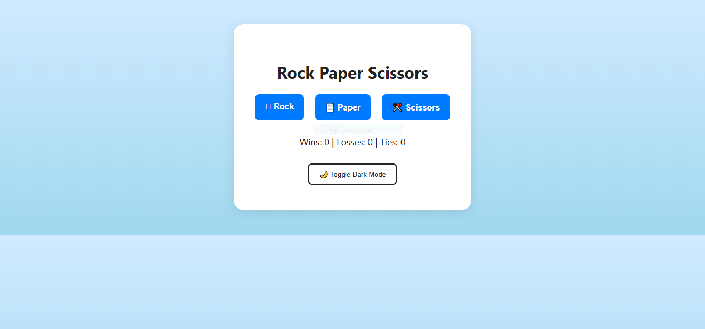

# Rock-Paper-and-Scissor-Game

A fun, interactive **Rock Paper Scissors** game built with **HTML, CSS, and JavaScript**.  
Includes sound effects, a scoreboard, confetti animations, and a dark mode toggle.  

## ✨ Features
- 🪨📄✂️ **Rock, Paper, Scissors Gameplay**
- 🎵 **Sound effects** for win, lose, and tie
- 🎊 **Confetti animation** when you win
- 🌙 **Dark Mode** toggle
- 📊 **Scoreboard** tracking Wins, Losses, and Ties
- 🎨 Clean and responsive design

## 📂 Project Structure

## 🚀 How to Play
1. Open `index.html` in your web browser.
2. Click on **Rock**, **Paper**, or **Scissors**.
3. See the computer's choice and game result instantly.
4. Track your score in the **Scoreboard**.
5. Toggle **Dark Mode** anytime.

## 🛠 Technologies Used
- **HTML5** – Structure of the game
- **CSS3** – Styling, animations, and dark mode
- **JavaScript (Vanilla)** – Game logic, sound effects, and animations
- **Canvas Confetti** – Celebration effect on winning
- **SoundJay** – Free button sound effects

